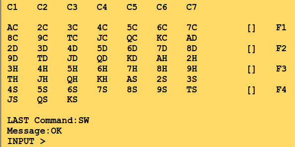

# Requirements - Yukon Solitaire

## Meta

The report requirements for the game Yukon Solitaire.

## Visual

This is what the game should look like.

- 7 horizontal rows

- 4 groups on the right side

- Console info at the bottom

    - LAST CommandType: The last commandType entered

    - Message: Any messages from the game

    - INPUT > : Where the user enters commands

## Commands (Console Input)

- `LD <filename>`
    - Load cards from `<filename>`. If no filename is given, load from `cards.txt`

- `SW` - Shows cards on the terminal in the order they are placed in the deck. For example, if we have a new
  unshuffled deck of cards is should show:

  

- `SI <split>`
    - `SI` -> Shuffle Interleaved
    - `<split>` is optional
        - determines the size of pile 1. The rest of the cards are put into pile 2.
    - split deck into two piles.
    - top card pile 1 -> pile 3
    - top card pile 2 -> pile 3
    - top card pile 1 -> pile 3
    - etc.
    - When one of the piles are empty we put the rest of the cards into the BOTTOM of pile 3

- `SR` Shuffles cards in a random manner. Take one card from deck and put it into random position in new empty pile

- `SD <filename>`
    - Save to `<filename>`.
    - If no filename is given, save to `cards.txt`

- `QQ` Quit program

- `P` Go to play phase

- `Q` Go to startup phase

- `Game Moves` is in the `<from> -> <to>`
    - `<from> -> <to>`
        - `<from>`

            - `C6` - column 6 -> last card moved
            - `C6:H4` column 6 : heart 4 -> cards moved
            - `F3` - foundation 3

        - `<to>`: Column number

### Available commands per phase:

**ALl phases**

| key  | result |
|------|--------|
| `QQ` | Quit   |

**Startup**

| key  | result              |
|------|---------------------|
| `LD` | load data           |
| `SW` | show cards          |
| `SI` | shuffle interleaved |
| `SR` | shuffle random      |
| `SD` | save data           |
| `P`  | to play phase       |

**Play**

| key              | result           |
|------------------|------------------|
| `Q`              | to startup phase |
| `<from> -> <to>` | make move        |

### Optional

- `U` Undo the last move.

- `R` Redo

- `S` `save <filename>`

- `L` `load <filename>`

## Rules

Startup phase and Play phase

### General rules

To play Yukon Solitaire, the entire deck is dealt into 7 columns of 1, 6, 7, 8, 9, 10, and 11 cards from left to right.

At the start the cards are dealt in the following way.

- C1: 1 card - 1 visible
- C2: 6 card - 5 visible
- C3: 7 card - 5 visible
- C4: 8 card - 5 visible
- C5: 9 card - 5 visible
- C6: 10 card - 5 visible
- C7: 11 card - 5 visible

Game is won by moving all cards into the four foundations arranged by suit and in order from Ace -> King.

Cards can be moved between the columns by placing a card (and the eventual cards below it) from a column to a new
column, below the bottom card from that column, if that card that has a value one greater than the card that we want to
move but is not of the same suit (it can also have the same color but from a different suit).

If there are no cards below a hidden card on a column, then the card becomes visible. Once all cards are moved to the
foundations, the player wins.
