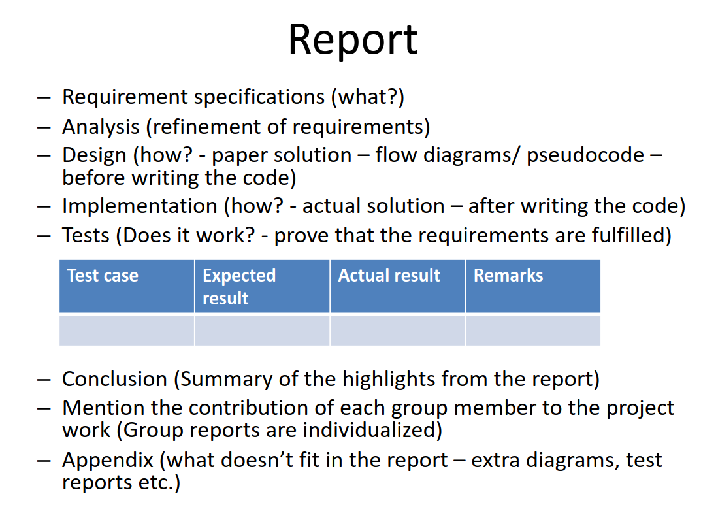

# Requirements - Yukon Solitaire

## Meta

The report requirements for the game Yukon Solitaire.

## Visual

This is what the game should look like.

- 7 horizontal rows

- 4 groups on the right side

- Console info at the bottom

  - LAST Command: The last command entered

  - Message: Any messages from the game

  - INPUT > : Where the user enters commands

## Commands (Console Input)

- Startup phase

- `LD <filename>`

  - Load cards from `<filename>`. If no filename is given, load from `cards.txt`

- `SW`

- `SI <split>`

- `SR` Shuffles cards into new pile. Add one card at a time to new deck pile.

  - only one position
  - 2 positions
  - 3 positions...

- `SD <filename>`

  - Save to `<filename>`.
  - If no filename is given, save to `cards.txt`

- `QQ` Quit program

- `P` Go to play phase

- `Q` Go to startup phase

- `<Game Moves>`

- `<from> -> <to>`

  - `<from>`

    - `C6` - column 6 -> last card moved
    - `C6:H4` column 6 : heart 4 -> cards moved
    - `F3` - foundation 3

  - `<to>`: Column number

### Optional

- `U` Undo the last move.

- `R` Redo

- `S` <filename>

- `L` <filename>

## Rules

Startup phase and Play phase

To play Yukon Solitaire, the entire deck is dealt into 7 columns of 1, 6, 7, 8, 9, 10, and 11 cards from left to right.

At the start the cards are dealt in the following way.

- C1: 1 card - 1 visible
- C2: 6 card - 5 visible
- C3: 7 card - 5 visible
- C4: 8 card - 5 visible
- C5: 9 card - 5 visible
- C6: 10 card - 5 visible
- C7: 11 card - 5 visible

Game is won by moving all cards into the four foundations arranged by suit and in order from Ace -> King.

Cards can be moved between the columns by placing a card (and the eventual cards below it) from a column to a new column, below the bottom card from that column, if that card that has a value one greater than the card that we want to move but is not of the same suit (it can also have the same color but from a different suit).

If there are no cards below a hidden card on a column, then the card becomes visible. Once all cards are moved to the foundations, the player wins.
